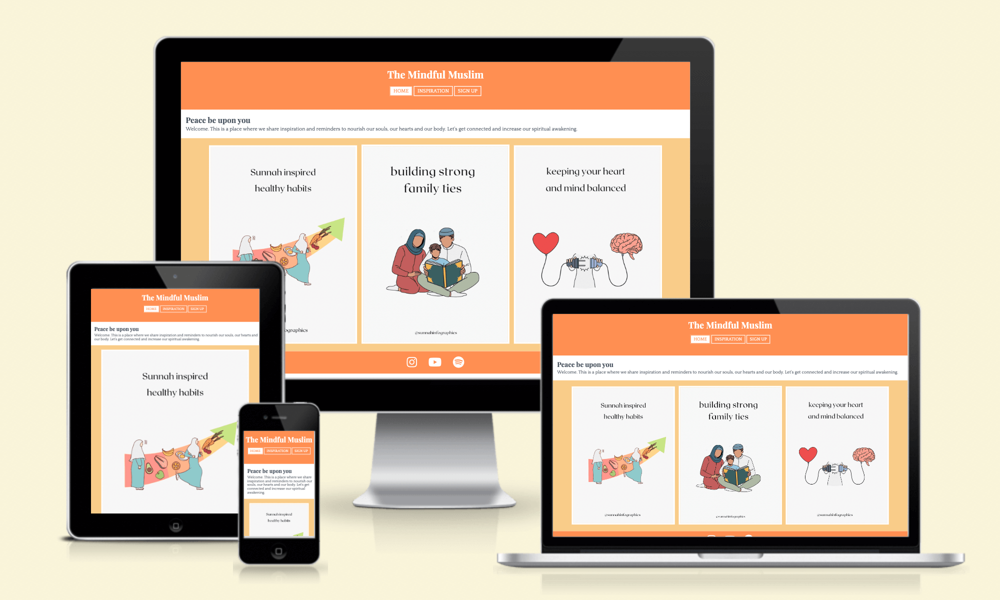

# The Mindful Muslim

[The Mindful Muslim](https://mristimaki.github.io/themindfulmuslim/) is designed as a motivational platform where I hope to encourage people to be more mindful of their physical and spiritual health. I wanted to create a joyful and straight-to-the-point website, therefore I have made the design simplistic, with bright uplifting colors and with infographic images that gives the visitor a clear picture of what you will find. This platform will provide useful tips that one can implement in their daily life, links to social media platforms that reflects the content of this website, along with quotes from the Quran and Sunnah (sayings of the Prophet Muhammad, Peace and Blessings be upon him).
 
 

 
## UX

### Goals

#### Visitor Goals

**The target audience for The Mindful Muslim:**

- People who are interested in health and spirituality.
- People who are interested in mindfulness.
- People who are interested in mindful parenting.
- People who wants to increase in religious knowledge. 

**User goals are:**

1. Learn about sunnah inspired health habits.
2. Become a more mindful parent.
3. Learn about islamic family values.
4. Become more aware and connected. 
5. Be able to sign up to get more inspiration and information.

**The Mindful Muslim will fill these needs by:**

- Providing the user with informative images (infographics) on home page.
- The images on homepage has a hover effect to highlight that it will link you to more information about the topic.
- Providing a simple header with navigation bar that is straight forward.
- Providing informative and inspirational quotes from Quran and Sunnah in Inspiration page.
- Social media links in footer that will provide the user with more information of these particular topics.
- Social media links to different platforms that will provide the user with reminders too choose from their liking. 
- Sign Up page that encourages the user to visit these social media links.
- Easy to find Sign Up form to get more reminders and inspiration about the topics weekly. 

#### Business Goals

**The Business goals of The Mindful Muslim are:**

- Gain subscribers via the sign up page.
- Present a good and clear design to gain interest.
- Get connected via the sign up page.

**User Stories** 
* As a user interested in islam, I expect to get accurate information with references where the information is collected.
* As a user interested in mindfulness, I expect to get simple and useful tips that I can easily adapt into my life.
* As a user interested in mindfulness and spirituality, I want to have different opportunities to gain knowledge and reminders that I can implement into my life daily, weekly or monthly. 
* As a user interested in health, I expect to get useful tips that I can easily adapt into my life both in movement, foods and mentally. 

## Visual Design

### Wireframes
Add either printscreens of the wireframes created in the beginning?

### The Fonts
I choosed the fonts for this webdesign via the [fontpair](https://www.fontpair.co/all) website.
I chose these particular fonts because I wanted a elegant and clean look to the fonts that complemented the more playful colours in a good way.

### The Colors

To create the playful yet empowering design I wanted, I looked up the emotional effects of colors. I chose the orange colours for the creative, playful and uplifting effects, white for inspiring and fresh look and charcoal for a elegant and empowering effect to the text. 

### The Images

I wanted the images on this website to be simple, informative and straight forward. Therefore I cose these infographics provided by [Sunnah Infographics](https://www.instagram.com/sunnahinfographics/), both to highlight their beautiful work and to encourage the user to visit their platform to gain even more knowledge about the topics provided in The Mindful Muslim. 

### The Icons
Center this image, do I have to make a div class or can I center it some other way?

The icons are taken from the [Font Awesome](https://fontawesome.com/) website. 
 
These are found in the footer for social media links. I wanted the icons to be white and simple in design but with a fun hover effect so that the user may get interested in visiting the social media links provided.
 

### The Styling
The styling of this page ...

## Features

### Page Elements

### Additional Features

### Feature Ideas

## Technologies used

### Languages
### Frameworks
### Libraries
### APIs
### Platforms
### Other Tools

## Testing

### Methods
### Bugs

## Deployment

### Local Deployment
### GitHub Deployment

## Credit and Contact

### Content
### Contact
