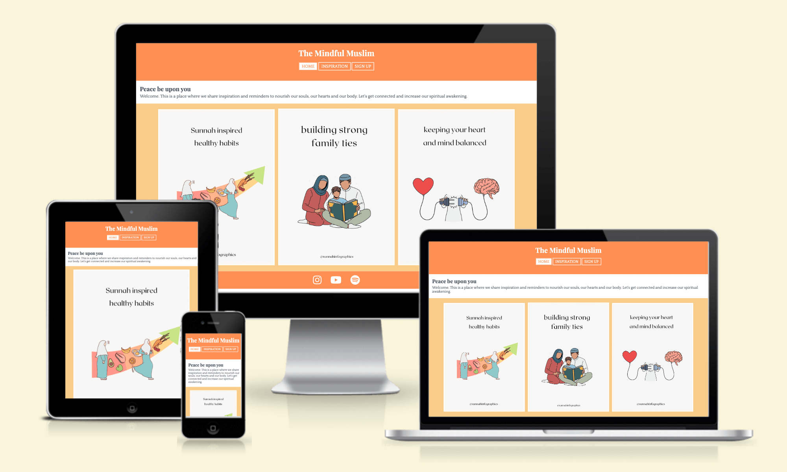

<h1>The Mindful Muslim</h1>
 
<a href="https://mristimaki.github.io/themindfulmuslim/" target="_blank">The Mindful Muslim</a> is designed as a motivational platform where I hope to encourage people to be more mindful of their physical and spiritual health. I wanted to create a joyful and straight-to-the-point website, therefore I have made the design simplistic, bright uplifting colors and with infographic images that gives the visitor a clear picture of what you will find in this platform. This platform will provide useful tips that one can implement in their daily life, links to social media platforms that contains the message I want to uplift with this platform, along with quotes from the Quran and Sunnah (sayings of the Prophet Muhammad, Peace and Blessings be upon him).
 
 

 
<h2>UX</h2>

<h3>Goals</h3>
<h3>Visual Design</h3>
 

<h2>Features</h2>

<h3>Page Elements</h3>
<h3>Additional Features</h3>
<h3>Feature Ideas</h3>
 

<h2>Technologies used</h2>

<h3>Languages</h3>
<h3>Frameworks</h3>
<h3>Libraries</h3>
<h3>APIs</h3>
<h3>Platforms</h3>
<h3>Other Tools</h3>
 

<h2>Testing</h2>

<h3>Methods</h3>
<h3>Bugs</h3>
 

<h2>Deployment</h2>

<h3>Local Deployment</h3>
<h3>GitHub Deployment</h3>
 

<h2>Credit and Contact</h2>

<h3>Content</h3>
<h3>Contact</h3>
